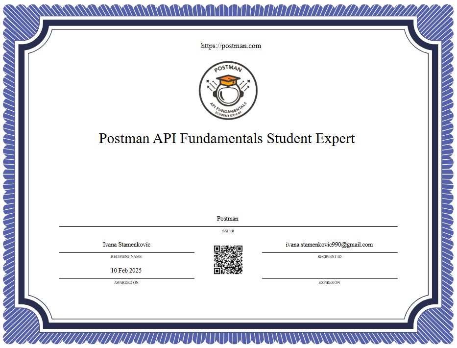

# postman-api-fundamentals-student-expert
[Postman Student Program](https://www.postman.com/student-program/) creates opportunities for students and educators to teach and learn API skills. Postman Student Experts are proficient in the essential skills required for consuming APIs in Postman and applications.

A hand’s on certification that teaches:

- What APIs are and their importance in modern software development
- How to use Postman to work with APIs
- Making GET, POST, PATCH, and DELETE requests
- Query parameters, bodies, headers, response codes
- Basic scripting
- API Key Authorization
- How to use APIs in your applications

 

<a href="https://api.badgr.io/public/assertions/LpCO4nP1SXipRfCzkjldVw?identity__email=ivana.stamenkovic990%40gmail.com">Postman API Fundamentals Student Expert Certificate]
</a>

